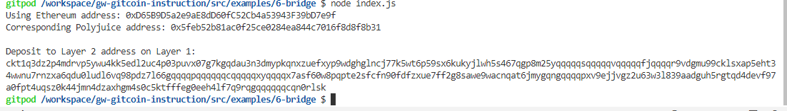

# tash 6
Task Submission

1. A screenshot of the console output immediately after you have successfully generated your Deposit Receiver Address.

2. Your Deposit Receiver Address (in text format).

Deposit to Layer 2 address on Layer 1: 

ckt1q3dz2p4mdrvp5ywu4kk5edl2uc4p03puvx07g7kgqdau3n3dmypkqnxzuefxyp9wdghglncj77k5wt6p59sx6kukyjlwh5s467qgp8m25yqqqqqsqqqqqvqqqqqfjqqqqr9vdgmu99cklsxap5eht34wwnu7rnzxa6qdu0ludl6vq98pdz7l66gqqqqpqqqqqqcqqqqqxyqqqqx7asf60w8pqpte2sfcfn90fdfzxue7ff2g8sawe9wacnqat6jmygqngqqqqpxv9ejjvgz2u63w3l839aadguh5rgtqd4devf97a0fpt4uqsz0k44jmn4dzaxhgm4s0c5ktfffeg0eeh4lf7q9rqgqqqqqqcqn0rlsk

3. The Ethereum address used to generate the Deposit Receiver Address (in text format).

Using Ethereum address: 0xD65B9D5a2e9aE8dD60fC52Cb4a53943F39bD7e9f

Corresponding Polyjuice address: 0x5feb52b81ac0f25ce0284ea844c7016f8d8f8b31

4. A link to the Etherscan explorer for the successful Force Bridge transaction. This can be found on Force Bridge under History→Succeed.

https://rinkeby.etherscan.io/tx/0x7cb77a710791df31686313d8681ed44216c9e1d283ed684f207a58c1038eff07

5. A link to the Nervos explorer for the successful Force bridge transaction. This can be found on Force Bridge under History→Succeed.

https://explorer.nervos.org/aggron/transaction/0xa580831b5c002b12469d4fca72d981b4d2cdeb3b339b504a3a2a639bd64bf2a9